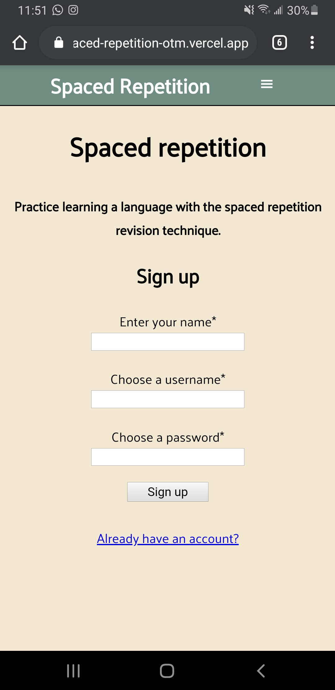

[Link to server repo](https://github.com/thinkful-ei-orka/spaced-repetition-api-otm)   [Link to the live app](https://spaced-repetition-otm.vercel.app/register)

# Spaced Repetition Learning

Spaced Repetition Learning is an evidence based method to learn a new skill.
<b>SpeakFast</b> is designed to teach users French by applying the spaced repetition algorithm. 

## Tech/Frameworks Utilized:
React, Node.js, PostgreSQL

## Screenshots  
    

## Contributors:
### Magdalena Painter
### Orkun Ozekin
### Taeil Kwak